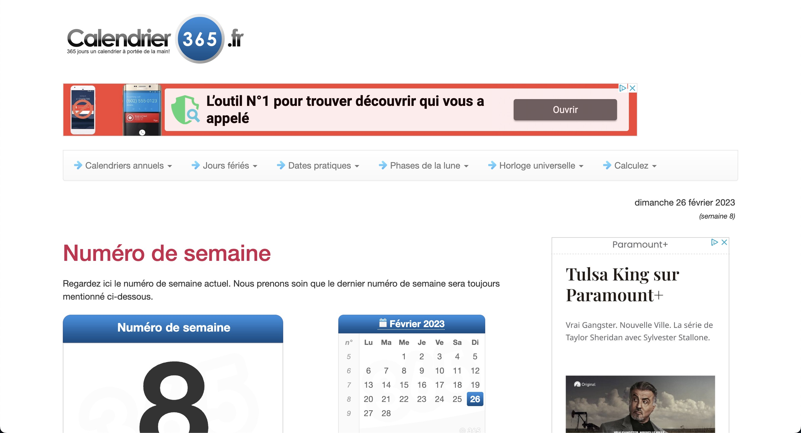

# numeroSemaine

J'en ai marre de taper "numero de semaine" sur Google, semaines après semaines, et tomber sur [ce site](https://www.calendrier-365.fr/numero-de-semaine.html).

C'est l'essentiel de tout ce que j'aime pas dans le web, une fonctionnalité qui est cachée bellow the fold, tout ça pour afficher toujours plus de publicité. Je sais qu'il faut bien manger, mais cela en est ridicule.

L'idée de numeroDeSemaine est d'être straight to the point. Peut-être d'avoir un peu d'analytics, un peu de publicité, mais d'avoir avant tout la feature demandée directement sur la page.
